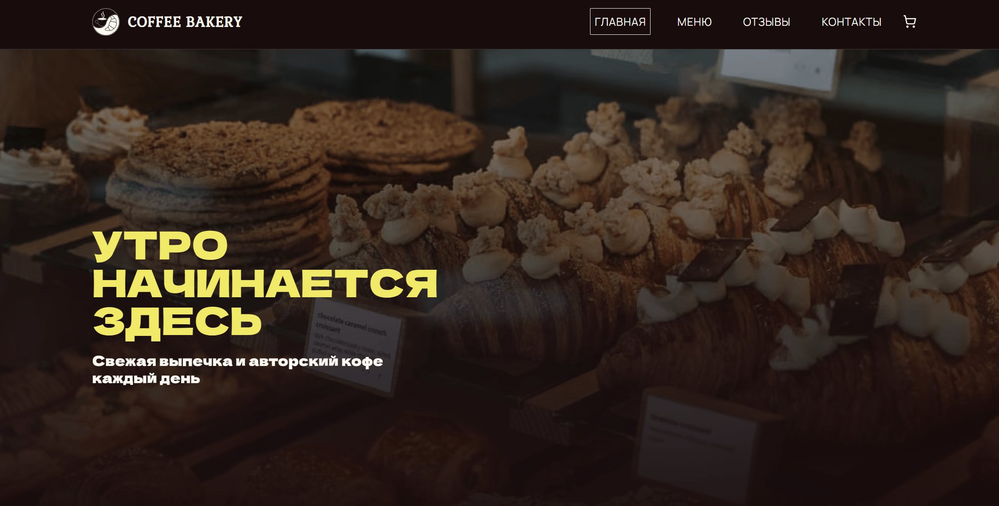
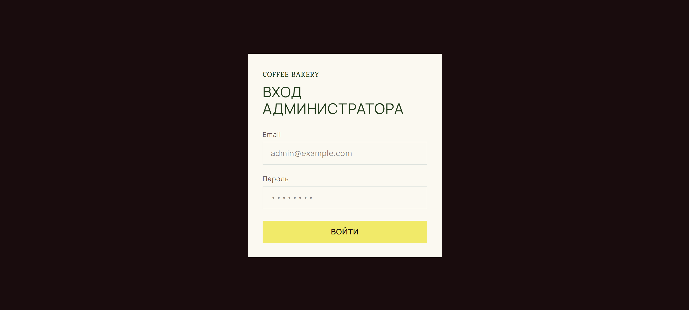
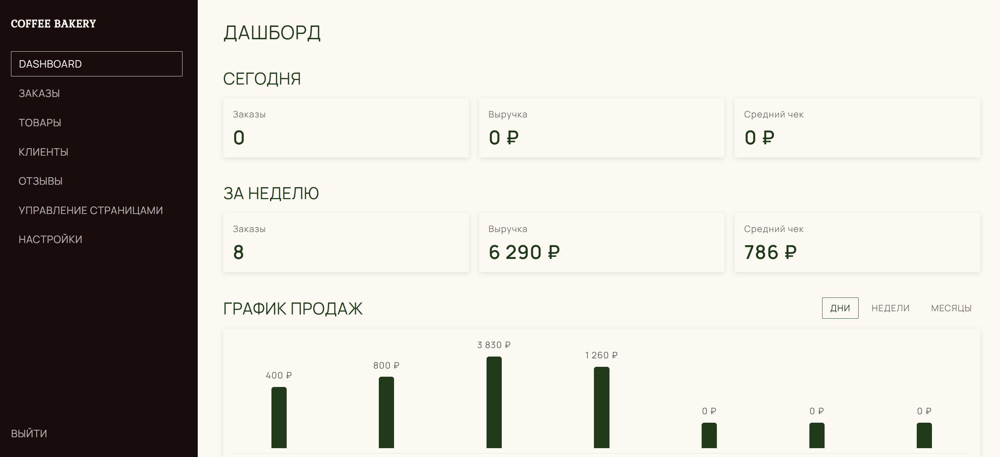

# Coffee Bakery

Интернет-магазин кофейни-пекарни: витрина с каталогом, страница товара, корзина,
оформление заявки без онлайн-оплаты и закрытая админ-панель для управления
товарами, заказами, клиентами и контентом сайта.

🔗 **Живая версия:** https://coffee-bakery-store.vercel.app/

## Технологии

- **Next.js 16** (App Router) + **React 19** + **TypeScript** (strict)
- **Prisma 7** + **PostgreSQL** (driver adapters, без нативного query engine)
- **NextAuth 4** — авторизация админки (Credentials + JWT-сессии, роли ADMIN / ORDER_MANAGER)
- **Zustand 5** — клиентское состояние корзины (persist в localStorage)
- **Tailwind CSS** — тёмная тема «moody brasserie», дизайн-токены в `DESIGN.md`
- **Zod** — валидация форм и тел запросов
- **Swiper** — слайдер отзывов
- **Cloudinary** — хранение фото товаров
- **Telegram Bot API** — уведомления о новых заказах
- **Vitest** + **React Testing Library** + **Playwright** — тесты
- Деплой на **Vercel**, миграции БД через GitHub Actions (CI → migrate deploy → deploy hook)

## Что сделано

**Витрина**
- Главная страница с меню товаров по категориям (табы с якорной прокруткой), слайдер отзывов, хедер и футер со скроллом к блокам
- Страница товара: состав, КБЖУ, вес/объём, цена
- Корзина-виджет (не отдельная страница): добавление, изменение количества, удаление, счётчик у иконки
- Оформление заявки гостем без регистрации → заказ падает в БД и в Telegram

**Админ-панель** (`/pekarnya-control`, URL намеренно не `/admin`)
- Dashboard: сводка за период, топ товаров, новые заказы
- Заказы: список с фильтрами по статусу, карточка заказа, смена статуса, история клиента
- Товары: CRUD, категории, загрузка фото в Cloudinary
- Клиенты: база с историей покупок (заполняется автоматически при заказе)
- Отзывы: модерация и ответ от имени магазина
- Только для ADMIN: управление страницами (О нас / Контакты / Доставка), SEO, баннеры, пользователи админки и роли, настройки уведомлений

**Архитектура**
- Server Components читают Prisma напрямую; `/api/*` — только для мутаций из клиента и HTTP-границ (auth, интеграции)
- Защита админки на трёх уровнях: `proxy.ts` (middleware), проверка сессии и роли в каждом мутирующем роуте, route group `(admin-only)` с редиректом
- Секреты сторонних API — только на сервере, вызовы обёрнуты в try/catch и не роняют основной флоу

## Скриншоты

### Главная страница


### Авторизация в админку


### Админ-панель


## Локальный запуск

```bash
npm install
npx prisma migrate dev
npx prisma db seed     # загрузит каталог из menu.json
npm run dev
```

## Скрипты

| Команда | Назначение |
| --- | --- |
| `npm run dev` | дев-сервер |
| `npm run build` / `npm start` | прод-сборка и запуск |
| `npm run lint` / `npm run typecheck` | ESLint / проверка типов |
| `npm test` | unit + component тесты (Vitest) |
| `npm run test:e2e` | e2e-тесты (Playwright) |
| `npm run prisma:studio` | Prisma Studio |
